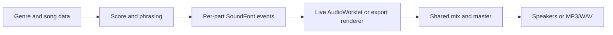

# Engine pipeline

The score compiler makes musical decisions once. It turns authored arrangements into parts with pitches, fractional timing, phrasing, and techniques. A SoundFont event planner resolves each requested part to bank, preset, key, velocity, and controller events.

Live playback and export share the event plan and mixer. Events and audio are computed when requested; complete songs and PCM stems are not pre-rendered. The browser keeps compressed SoundFont banks so they do not need to be fetched again.

Main code: `src/data` (musical authoring), `src/engine/score` (score compilation), `src/engine/playback/soundfont` (event planning and sample rendering), and `src/engine/playback` (transport, mixing, and export).
