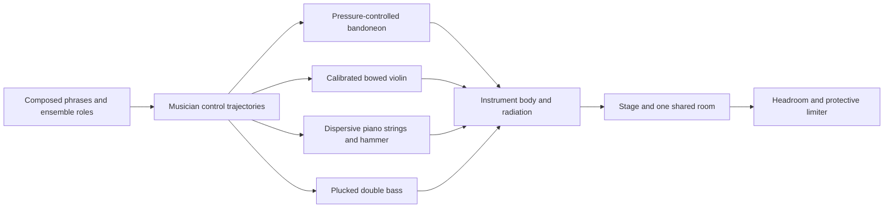

# Tango synthesis design notes

This document records an earlier graph inspection and proposed design work. Numerical counts and source descriptions below are observations from that snapshot, not assertions about the current renderer or catalog. Rerun the cited audit against the current checkout before using them as measurements.

The current score checks establish that notes, rests and techniques survive compilation. They do not establish good sound. The previous corrections are useful, but the present synthesis architecture still falls short of a convincing tango ensemble. Playback and export now use the physical instrument models directly, so improvements must address their synthesis and performance behavior.

The recommended next step is a tango-only sound benchmark and four calibrated instrument models. Instrument identity and musical performance must improve before more effects or catalog expansion can count as progress. The working target is a dry, forceful Golden Age orquesta típica; a specific reference recording should determine the final articulation, ensemble and recording aesthetic.

## What the actual graphs show

Run `node --import tsx scripts/audit-tango-graph.ts`. It compiles the Golden Age starter and traverses the actual reachable Elementary graphs, including generic wrappers. The complete nodes and connections are written under `audit/tango-graphs/`; the summary is `audit/tango-graph.json`.

| Instrument | Core nodes / wrapped note | Maximum held notes / reserved voices | Physical graph at that instrument's reservation peak |
| --- | ---: | ---: | ---: |
| Bandoneon | 157 / 293 | 1 / 8 | 1,446 nodes |
| Violin | 246 / 421 | 1 / 7 | 2,045 nodes |
| Piano | 223 / 386 | 3 / 6 | 1,608 nodes |
| Double bass | 143 / 312 | 1 / 13 | 2,438 nodes |

These are reachable node counts, including cheap constants and arithmetic, not CPU measurements. The reservation peaks occur at different times and must not be added as a simultaneous ensemble peak. Released voices may be retained long after their useful envelope has ended. The bandoneon retains a 2.2-second reservation and violin a four-second reservation, despite much shorter amplitude releases.

The browser mix builders also allocate 188 nodes: 86 in the master and 102 in dynamic strips/buses. This includes inactive drum/sub/ducking routes, seven logical buses, individual room sends, stereo matrix stages, six room feedback lines, echo and several compression stages. Allocation alone is not evidence of poor sound, but much of this machinery does not address tango's missing source and performance behavior.

The physical graph is the instrument source for every newly rendered note in playback and export. Rendered performance stems can be reused in memory while their notes and sound settings remain unchanged.

## Why a larger graph is not delivering richer music

- **Bandoneon:** its source is two BLEP saws, mixed at fixed weights, then saturated. Pressure mostly controls gain/drive. Body filters follow the note's frequency, rather than representing a measured case response. The model lacks calibrated pressure-dependent spectra, reed starting thresholds, separate reed response times and evolving behavior through a phrase. An 8′/4′ label does not supply those properties.
- **Violin:** the claimed Helmholtz stick-slip behavior is a saw oscillator with random frequency jitter, saturation, noise and resonant coloring. Bow pressure and speed do not drive a nonlinear bow/string feedback system. More rosin noise and resonance cannot turn that source into a convincing bowed string.
- **Piano:** filtered noise excites several similar delay loops. The claimed inharmonicity shifts a unison oscillator frequency; it does not produce frequency-dependent dispersion of the string's partials. The hammer, changing partial decay and damper/pedal interaction need calibration. Random noise attacks help explain why a mechanically elaborate patch can still suggest a plucked toy.
- **Bass:** a noise-excited loop and extra sine/body layers supply a rough bass identity, but the attack spectrum, string loss and body response are estimates. It needs a clear pitch-bearing pluck and controlled body energy, not unrelated low-frequency embellishment.
- **Wrappers:** the core already supplies body and excitation details, then a second generic layer adds resonances/noise and per-voice inserts. For example, the inspected violin note grows from 11 to 30 SVF nodes. Multiple bare `noise()` calls also share one reachable random generator inside the inspected graph. These layers should have measured, explicit ownership instead of accumulating by metadata category.
- **Score:** the 40-bar study contains 800 notes, but the developed bandoneon and violin each use only two distinct bar rhythm/technique shapes; the bass uses one. This count excludes pitch, velocity and timing nuance, so it is not a complete composition metric. Inspection nevertheless confirms short motifs repeatedly repitched against chords, with little sustained thematic development. Correct notes alone do not provide the musical tension, release and coordinated articulation of an arranged performance.

These are code and graph findings. No claim here is based on hearing a real recording or on a completed blind listening test. Describing the current models as "authentic" overstates the evidence.

## Replacement design

“Instrument body” above means each instrument's own response, not one identical filter for all four. Linear body processing can follow summed string/reed contributions where the model permits; independent instruments retain their own bodies.

1. **Build the bandoneon first.** Fit pressure/register/direction-dependent harmonic amplitudes and phase, onset/release behavior and limited pitch changes from real isolated playing. Interpolate compact coefficient sets or periodic oscillator tables in real time. Use one bellows state shared by a player's voices, with individual reed response. Keep mechanical noise subordinate and intentional. A full fluid simulation is not required; measured source/filter behavior is a more credible first route than choosing arbitrary saw/filter values.
2. **Give violin real bow behavior or a measured equivalent.** Use a stable nonlinear bowed-string waveguide with a calibrated body response, or a compact model fitted to recorded bow gestures if it gives the better listening result. Bow force, speed, position, note transitions and vibrato must shape tone over time. Replacing saw waves with another uncalibrated algorithm is insufficient.
3. **Model piano and bass at their sources.** Piano needs a dispersive stiff-string or fitted modal model, velocity-dependent hammer excitation, differentiated unison decay and actual damper/pedal state. Bass needs calibrated pluck position/excitation, pitch-dependent losses and corpus radiation. Use a small number of meaningful parameters and fitted coefficients.
4. **Compose one convincing passage.** Write a 16–32-bar original tango with an eight-bar melodic sentence, contrasting answer, bass/piano voice leading, purposeful low-register weight, tutti accents and breathing space. Represent piano hands and bandoneon manuals explicitly. Coordinate timing and intensity at the phrase/ensemble level; avoid independent random jitter on every event. Hold that score fixed while comparing sound engines.
5. **Make the runtime persistent and bounded.** Once the models pass their sound tests, run them in a persistent AudioWorklet, with a WASM kernel if profiling justifies it. Update controls and retain resonator state instead of rebuilding long note graphs or rendering every edit into full-song PCM. A voice should stop consuming work when its audible state decays, while a useful string/pedal resonance must survive. Elementary can remain the prototype backend; it is not itself the reason the current models sound generic.
6. **Use a restrained acoustic mix.** Apply instrument body/radiation once, then stage position and one shared room. Start with preserved transients and headroom. Add compression or coloration only if the reference and level-matched comparison justify it. A loudness increase must not masquerade as better timbre.

Compact model coefficients or periodic oscillator tables allow timbre to respond continuously to pressure and gestures. Measurement-derived synthesis still requires source recordings for development; those recordings need not ship with the application. If absolutely no recorded or measured data is allowed even during development, achieving a convincing imitation becomes substantially less certain.

## Quality and size gates

The following are proposed targets, not achieved results:

- Less than 1 MiB of shipped tango model data. Measure the engine binary and application/catalog bundle separately.
- Fixed memory during sustained playback and a callback CPU budget verified on an agreed ordinary laptop/phone. Report worst-case polyphony and high-percentile callback time, not an offline render's average speed.
- Three tests per instrument: exposed attack/repeated short notes, held crescendo/decrescendo, and connected phrase. Compare identical notes and controls at matched loudness, both dry and in the ensemble.
- Compare the fixed tango passage using the current engine, the replacement and a recorded reference performance. Independently compare phrasing, orchestration, dynamics and recording space against the chosen real performance. A score/arrangement deficit must not be blamed on the synth, or vice versa.
- Use spectra, time-varying harmonic envelopes, pitch, decay and transient measurements to find defects. Use blind listening and tango-musician feedback to decide whether the replacement has convincing identity, weight and expression. No numerical pass can replace musician review.

The first deliverable should be an exposed, expressive bandoneon phrase and a four-instrument tango passage with a repeatable A/B comparison. Expand only after that passage meets the listening and size gates.

## Relevant primary research

[Ramos, Riera and Calcagno, NIME 2023](https://nime.org/proceedings/2023/nime2023_23.pdf) describes bandoneon synthesis with measured acoustic mappings and interpolated periodic waveforms. It documents pressure-dependent timbre/pitch and note-dependent response, and demonstrates an embedded real-time instrument. This supports the proposed calibration method; it is not evidence that our present patch implements it or that its published timbre necessarily meets this project's target.

[Puranik and Scavone, DAFx 2023](https://www.dafx.de/paper-archive/2023/DAFx23_paper_47.pdf) develops a perceptually informed source/filter approximation of a free-reed instrument from a physical model and estimated enclosure response. It concerns harmonium; bandoneon-specific measurements are still needed.

[Smith, Bowed Strings](https://ccrma.stanford.edu/~jos/pasp/Bowed_Strings.html) describes the bowed-string modeling family. A saw oscillator and added friction noise do not constitute a nonlinear bow/string model.
