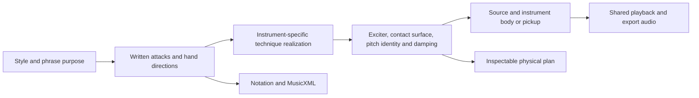

# Playing technique, instrument mechanics, and pattern realization

The system already preserves much of the musical decision chain, but it did **not** accurately capture all the relationships between technique, instrument mechanics, and the resulting pattern. Several technique names selected the wrong source, percussion acquired harmonic-note behavior, and active pattern data often omitted the hand actions that its descriptions implied. The changes in this review improve those relationships substantially. They do not establish perceptual equivalence to an acoustic performance.

## What must be represented

A convincing performance needs more than a rhythm and a technique label. It needs the following connected decisions:

1. **Musical purpose:** accompaniment, melody, compás accent, pickup, response, closure, or an intentionally featured effect. A technique belongs to a phrase and ensemble role.
2. **Playable action:** which hand, finger, string, stroke direction, contact surface, and source of energy produce that purpose. A bow attack, a finger release, and a soundboard tap can share a beat while requiring different mechanics.
3. **Control evolution:** how force, speed, damping, and pitch change during the action and between actions. Articulation affects this evolution; it should not arbitrarily replace the exciter.
4. **Acoustic response:** the string, afterlength, membrane, reed, body, or pickup responds to that excitation. A body's modes are not automatically the harmonics of the current chord.
5. **Evidence:** written directions survived, the physical controls actually affect the rendered graph, the PCM behaves sensibly, and musicians judge the performance convincing. These are different claims.

The existing notation → band interpretation → physical plan → cached DSP → ensemble mix architecture is an appropriate foundation. Written beats and expression are separate, section-owned notes retain their tails, and live playback and export consume the same physical performance. The principal problems were semantic and acoustic choices within those layers.

## Tango bowed strings and double bass

Ordinary tango bow articulation and extended percussion should be treated separately. Short détaché, connected arco, pizzicato, and an arrastre need different attack and energy behavior. An arrastre builds toward an accent; its approach pitch and rhythmic placement belong to the score. A fixed oscillator scoop attached to every use of the word cannot represent all interpretations.

Caroline Pearsall's practitioner account distinguishes violin chicharra on the wrapped string segment behind the bridge, tambor as deliberately dry damped pizzicato, and golpe de caja as body percussion. It also describes bass/cello strapata using bow bounce and left-hand contact. These are not interchangeable ways of making a louder note. [Pearsall's illustrated explanation](https://www.deviolines.com/12-tecnicas-para-tocar-tango-con-violin/). Stephen Meyer's research glossary likewise distinguishes double-bass strappata from violin tambor. [Royal College of Music thesis](https://researchonline.rcm.ac.uk/id/eprint/2638/1/Stephen%20Meyer%20PhD%20Thesis%20PUBLISHED%20VERSION.pdf).

### Findings and corrections

| Path | Previous behavior | Revised behavior |
|---|---|---|
| Upright strappata | Shared the slap path; clack, pitched sine, and added sub-octave thud | Unpitched short bow-bounce roll with damped string contact |
| Upright tambor | Lower-bout wooden hit | Dry damped-string contact, separate from golpe-caja |
| Violin tambor | Mixed string snap and body-thump interpretation | Dampened pizzicato contact; finger excitation |
| Chicharra | Violin, viola, and cello ring frequency followed the written MIDI pitch | Afterlength/noise effect whose frequency does not follow harmony |
| Arrastre | Universal downward pitch offsets, including three semitones on bass | Bow energy rises; authored approach and target pitches retain ownership |
| Pizzicato on a bowed instrument | Renderer used a pluck, while the generic lifetime could remain sustained | Excitation and decaying/held classification agree |
| Body/percussive chord | Could trigger the same physical effect once for every inferred chord tone | One physical contact per musical attack |
| Generic DSP wrappers | Could add another set of pitch-relative resonators and artifacts after a bespoke body | Violin, viola, cello, and upright own their body/artifact sections; special string percussion bypasses pitched wrappers |

The new `TechniqueMechanics` record distinguishes string, damped string, afterlength, and soundboard contact; excitation source; pitched/unpitched identity; damping; selected bow/pluck controls; bounded percussion tails; and implementation fidelity. The prepared note carries this record through caching and rendering.

The bowed sources remain saw/noise/filter approximations. They do not solve a nonlinear bow–string scattering junction. Bow speed and force shape the approximation, but it lacks a shared bow/string state across connected notes and a calibrated friction regime. Physical bowed-string modeling explicitly treats the bow as a nonlinear junction dividing the string into two sections. [Julius O. Smith's bowed-string model](https://ccrma.stanford.edu/~jos/pasp/Bowed_Strings.html).

The new strappata roll has estimated bounce timings and noise spectra. It models the action category, rather than an entire performer-specific bow rebound. Body modes and afterlength resonances also remain estimates. These limits are recorded rather than described as faithful acoustic synthesis.

## Bass as a rhythmic and percussive instrument

Electric thumb slap, electric pop, upright slap, tango strappata, dead notes, and body strikes need separate treatment. Some retain a definite bass pitch and add collision energy; others intentionally remove a definite pitch. A ghost note is also not necessarily a completely dead note.

Fender's teaching material distinguishes thumb slap and pop, while Discover Double Bass teaches upright single/multiple slap patterns as a separate performance method. [Fender technique curriculum](https://www.fender.com/play/bass/skills), [Joe Fick's upright slap method](https://courses.discoverdoublebass.com/p/slap-that-bass).

Previously `bass`, `upright-bass`, and `guitarron` all selected the upright module. Electric slap inherited acoustic-bass cavity modes, and pop did not have a dedicated source response. The new electric-bass module uses a plucked string/pickup approximation with separate thumb/pop collision spectra and pluck positions. Ordinary slap and pop retain pitch; dead-note contact is unpitched and rapidly damped. Acoustic bass guitar remains an explicit variant. Electric bass acquires no arco route.

Pluck position now affects the excitation of guitar, upright pizzicato, and electric bass through a position-dependent cancellation comb. It is no longer merely descriptive metadata. Feedforward combs can represent excitation and pickup locations in compact string models. [Julius O. Smith's derivation](https://www.dsprelated.com/freebooks/pasp/Equivalent_Forms.html). This is a useful source-shaping approximation, not a full finite-displacement model. The electric pickup response is likewise a compact estimate, not a calibrated electromagnetic pickup.

Remaining limitations include string-specific setup, fret/fingerboard collision thresholds, individual pickup placement, left-hand release, slap-to-pop recovery, and stateful hammer-ons/pull-offs. The shared guitarrón-to-upright mapping also remains an approximation that deserves its own future model. Upright slap supports a pitched pluck with collision; idiomatic multiple slaps must still be written as separate events rather than inferred from one label.

## Flamenco: fingers, strings, soundboard, and compás

Rasgueado is a rhythmic sequence of strokes, not a noise cloud added to a chord. Alzapúa coordinates thumb actions across a bass note and string sweeps. Picado is a single-note finger technique. Flamenco tremolo needs independent thumb/bass and repeated upper-note attacks. Golpe adds a soundboard contact, often alongside a string action.

Oscar Herrero's method explicitly gives several rhythmic rasgueado formulas and p–i–a–m–i tremolo exercises. Consequently, one fixed number of synth bursts cannot stand in for the whole technique. [Herrero's bilingual method sample](https://www.oscarherrero.info/OHE/pdf/025/LCD-200E_muestra_sample.pdf). The simultaneous thumb/golpe relationship is demonstrated in [Latin Guitar Mastery's alzapúa and golpe lesson](https://www.latinguitarmastery.com/lesson/alzapua-and-golpe/).

### Findings and corrections

The guitar renderer previously inferred rasgueado from `articulation > 0.6`. A generic articulation control could therefore produce a flamenco effect. Its five envelopes also changed attack ramps rather than scheduling distinct strokes in musical time. Both behaviors have been removed. Each rendered excitation now corresponds to a written stroke; repeated fingers are represented by distinct beat-positioned events.

The active catalog is generated from `catalog.ts` authored cells through `genrePack.ts`. Several richly described patterns in the legacy `patterns.ts` files were not the active source for generated styles. Updating their descriptive vocabulary alone would not improve playback. This review updates the active cells and adds notation directions to `AuthoredCell` so they flow through event projection into the written score.

Three original study cells now exercise the complete path:

- **Soleá tremolo:** two p–i–a–m–i groups, five attacks per quarter-note span, separate bass/upper register descriptors, explicit fingerings and 5:4 tuplets.
- **Alzapúa closure:** a thumb bass note followed by down/up chord strokes, explicit triplet positions, and a simultaneous golpe on the opening action.
- **Rumba accompaniment:** alternating written up/down chord strokes with selected simultaneous golpes. This is one accompaniment choice, not a universal rumba formula.

The pattern identities are retained. Downstrokes traverse the selected pitches low-to-high; upstrokes reverse that order. The complete sweep is bounded by the written duration. This is an acoustic ordering approximation: without complete string/fret assignments, the engine cannot know the precise string order, duplicated pitches, or skipped strings of a real voicing.

A new `notation.bodyTechnique` field represents a simultaneous golpe or golpe-caja while the primary technique remains a string action. The first performed tone owns that body attack exactly once. It survives the score JSON, physical plan, cache identity, and MusicXML technical directions. This avoids replacing the chord with a body tap or multiplying the tap by chord size. The companion enters after pitched resonators and retains its impulse envelope when the primary string source has a slow bow attack.

Authored tuplets reach MusicXML time modifications. Unpitched string/body actions export as unpitched x-noteheads, even inside a pitched instrument part. The inspector labels them as unpitched contact and displays simultaneous body directions. MIDI and GP5 remain limited interchange formats; their numeric note payload is not evidence of the percussion's acoustic pitch.

The guitar still uses approximate plucked loops and a body-filter response. Nylon setup, action height, nail/flesh proportion, apoyando contact with the adjacent string, the golpeador, and persistent independent strings are not fully modeled. The cells improve musical causality; they do not establish equality to a flamenco guitarist's sound.

## General errors exposed by the review

**Global excitation names were too broad.** `staccato` and `trill` appeared in a hammer-excitation set; `ricochet` and heavy détaché appeared in a hard-pick set. Those lists have been removed. Source-changing gestures are now interpreted within the instrument, and ordinary accent/length articulations retain the instrument or variant's excitation. Bowed aliases cannot casually turn the instrument into a picked guitar.

**A vocabulary entry was being counted as faithful synthesis.** Every declared articulation acquired `fidelity: faithful` regardless of its DSP behavior. Catalog membership now provides no such certification. Reviewed mechanisms are approximate; unsupported acoustic behaviors remain symbolic. Source evidence and musical vocabulary are separate from renderer quality.

**Genre preferences contained unavailable techniques.** Curated/authored preferences are filtered through the instrument's actual gesture catalog. A genre association cannot create a nonexistent gesture. Body percussion is also classified separately from membrane percussion in performance profiles.

**Technique quotas could remove melody.** Phrase optimization could insert a required body/percussion gesture into a normal pitched sentence solely to increase vocabulary coverage. Automatic pitched landmarks now exclude unpitched string/body effects. Explicitly written effects and appropriate rhythmic hit intents remain available. Authored event techniques are read from the written attack itself, keeping them aligned when projection filters events.

**Bounds were based on the browsing family.** Upright bass is catalogued as plucked but can use a bow. Its prepared excitation now determines held/decaying behavior. Short body/damped-string effects get bounded release occupancy rather than multi-second generic string reservations.

## What robustness does and does not mean here

The revision makes the semantic pipeline more coherent and gives several controls observable acoustic consequences. It protects written timing, pitches, and directions; preserves simultaneous action ownership; prevents body effects from following harmony; separates electric and upright sources; and ties the selected exciter to envelope and release behavior.

It does not yet implement a full performer simulator. The catalog's `maxActuationHz`, hand counts, and polyphony are not a complete constraint solver for finger recovery, string crossings, bow reversals, impossible fretting, and simultaneous gestures. Such a solver should report an infeasible passage or apply an explicitly chosen adaptation policy. Silently dropping attacks or inventing a different technique would break the score contract.

Similarly, a connected bow phrase or left-hand hammer-on should continue a physical resonator's state rather than always start an independent source. Shared bellows state, persistent strings/dampers, reed thresholds, and breath reservoirs require model-specific work. The existing section/cache boundaries preserve note ownership, but they do not supply this missing inter-note mechanics.

### End-to-end coverage after the changes

| Information | Written/interpretation path | Audible realization and remaining gap |
|---|---|---|
| Beat, duration, pitch, and authored technique | Fractional positions and written attacks feed the canonical musician score | Shared playback/export uses that score; expression changes sounding timing separately |
| Tremolo or rasgueado finger sequence | The new flamenco cells write each p/i/a/m/i or stroke event explicitly | Independent attacks sound at their written positions; individual nail shape and finger recovery remain unmodeled |
| Fingering | Preserved in pattern notation, musician score, inspector, and MusicXML | Primarily a performance instruction; the DSP does not maintain an independently parameterized finger for every digit |
| String and fret | Written string/fret can determine pitch; contradictory authored MIDI is rejected | Pitch resolves, but persistent individual strings, sympathetic transfers, and an ergonomic voicing solver are incomplete |
| Strum direction | Written up/down strokes reach the final realization pass | Guitar chord traversal reverses; it approximates pitch order without complete physical string assignments |
| Bow direction | Up/down bow survives notation and MusicXML | No persistent bow-position/reversal state or direction-dependent friction solver |
| Pluck position and damping | Physical controllers and technique-specific values reach the prepared voice | Guitar, upright, and electric-bass excitation changes; damping shortens physical decay |
| Bow pressure and speed | Prepared parameters reach the bowed renderers; lija selects reviewed control values | Source/filter amplitude and noise change; the controls do not establish a measured friction regime |
| Simultaneous body and string contact | One companion action belongs to the first performed tone | Separate fixed body modes and impulse envelope share velocity/effects with the string source |
| Unpitched contact | Explicit identity reaches notation, canonical score, physical plan, inspector, and MusicXML | Reviewed body/damped-string/afterlength paths do not transpose with harmony; MIDI/GP5 still have numeric interchange payloads |
| Contact point and effective mass | Derived values exist in the prepared voice | Contact point is consumed in the drum path, but many string sources do not consume these fields; mass is not a general physical contact solver |
| Hand count, actuation rate, fatigue, finite bow/breath | Rich catalog interfaces describe these concepts | No general runtime feasibility/state solver was found in the arrangement and playback paths; metadata alone cannot enforce them |
| Timbre fidelity | Catalog vocabulary now distinguishes approximate and symbolic implementation | Numerical rendering health is tested; measured model fitting and expert listening remain outstanding |

This is why apparently comprehensive instrument metadata can overstate actual capability. A field reaching JSON is not equivalent to the renderer consuming it, and an audible control response is not equivalent to a physically calibrated response.

Measured and unmeasured tremolo also require different contracts. The new flamenco tremolo is a written rhythmic sequence. Existing bowed tremolo uses fixed-rate amplitude/noise modulation, which can approximate unmeasured tremolo but should not be presented as measured re-bowing with a specified subdivision. Ricochet needs a rebound trajectory; a short three-contact strappata approximation is not a general ricochet model.

For percussion, the corresponding questions are whether an open tone, muted tone, rim contact, and slap share the correct membrane/object response; whether hands can reach and recover for the written sticking; and whether damping continues after contact. For winds and reeds, they are whether tongue attacks preserve the air/reed exciter and whether breath or bellows energy persists across notes. The new instrument-specific excitation resolution fixes the shared category error, but this review does not claim to have acoustically calibrated every drum, reed, wind, or regional string instrument. Some instruments still share render modules, including several regional bowed strings with the violin module; their independent construction and idiomatic mechanics need separate audits.

### Better pattern realization next

The next major architectural step is a small instrument-state layer between the canonical score and sound plan. Each action should name its source, string/contact target, performer resource, onset trajectory, damping/termination, and any continuing resonator. A compiler can then check adjacent actions against the current hand/bow/string state and emit an explicit feasibility result. It should retain authored rhythm and pitch, and explain any requested adaptation instead of silently changing them.

For a bow phrase, that state would carry contact, bow direction and remaining travel, then generate an energy ramp or reversal between notes. For a slap-bass pattern, it would distinguish a pitched thumb attack, pitched pulled-string pop, left-hand dead contact, and a recovery interval. For flamenco, it would allocate thumb and fingers, preserve independently voiced bass and upper strings, and coordinate a golpe without duplicating the string stroke. Those changes improve how a whole pattern is played; adding more noise to isolated notes cannot supply the missing sequencing.

Use that layer first with a few short, explicitly fingered patterns. Calibrate their actions against recordings, then extend the vocabulary only when the existing end-to-end checks and listening comparisons support the new mechanism. This reduces the risk of a larger descriptive catalog growing faster than its actual rendering capabilities.

## Verification and further authenticity work

The added structural suite checks instrument/variant excitation, tango mechanism distinctions, up/down ordering, one golpe per chord attack, written rhythm preservation, finite release ownership, actual reachable graph pitch independence, muting, unsupported body combinations, invalid tuplets, and active-catalog notation-to-physics-to-MusicXML transfer. The PCM suite renders nineteen instrument/technique combinations through the shared playback/export renderer and checks finite audible output, body-impulse decay under a held gate, pluck-position response, and simultaneous body-contact output.

These tests are integrated into `npm run check` and `npm run check:audio`. Existing score, cache, playback, and audio regressions remain necessary because a plausible isolated attack can still break a complete arrangement. Numerical checks establish mechanism integrity and renderer health; they cannot certify an authentic musical performance.

The next authenticity work should keep a short written passage fixed and compare each mechanism dry, then in its ensemble. Record or obtain licensed isolated examples of ordinary bow attacks, arrastre, chicharra, tambor, strappata, bass slap/pop, rasgueado fingers, alzapúa, and simultaneous golpe. Measure onset spectra, noise/tonal balance, contact timing, pitch evolution, decay, and force dependence. Fit compact model coefficients rather than adding arbitrary resonances.

Use matched loudness and identical scores in listening comparisons. Ask tango and flamenco practitioners separately about technique identity, phrase timing, accompaniment interaction, and sound quality. Record the result by instrument, style, and technique. A model may have the correct mechanism but poor timbre, or attractive timbre with incorrect hand action. Both failures need explicit evidence and separate remedies.

The appropriate claim after this revision is **better specified and tested technique realization with approximate synthesis**. Stronger authenticity claims require that calibration and musical review.
